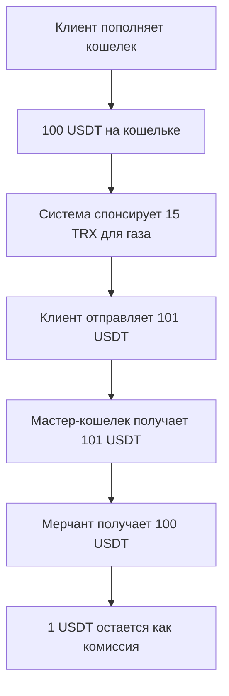

# 💰 Экономическая модель Multi-Chain Payment Gateway

## 📊 Обзор модели доходности

Multi-Chain Payment Gateway использует **гибридную модель комиссий**, которая обеспечивает предсказуемые затраты для мерчантов при сохранении конкурентоспособности.

### 🎯 Принципы ценообразования

1. **Прозрачность** - все комиссии известны заранее
2. **Предсказуемость** - фиксированная структура комиссий
3. **Справедливость** - комиссии покрывают реальные затраты + разумная маржа
4. **Масштабируемость** - скидки при больших объемах

## 💸 Структура комиссий

### 📋 Базовая структура

| Компонент                 | TRON (USDT) | Ethereum (USDT) | Описание                       |
| ------------------------- | ----------- | --------------- | ------------------------------ |
| **Сервисная комиссия**    | 0.5%        | 0.5%            | Комиссия платформы             |
| **Газ сети**              | ~$2.50      | ~$15-50         | Стоимость блокчейн транзакции  |
| **Минимальная комиссия**  | $1.00       | $1.00           | Минимальная плата за обработку |
| **Максимальная комиссия** | $10.00      | $50.00          | Потолок сервисной комиссии     |

### 🧮 Формула расчета

```
Общая стоимость = Сумма заказа + Сервисная комиссия + Газ сети

Где:
Сервисная комиссия = max(Мин. комиссия, min(Сумма × 0.5%, Макс. комиссия))
Газ сети = Текущая стоимость газа в сети (динамическая)
```

### 💡 Примеры расчетов

#### Малый платеж ($10)

```
Заказ: $10.00
Комиссия: max($1.00, $10 × 0.5%) = $1.00 (минимальная)
Газ TRON: $2.50
ИТОГО: $13.50 (35% накладные расходы)
```

#### Средний платеж ($200)

```
Заказ: $200.00
Комиссия: $200 × 0.5% = $1.00
Газ TRON: $2.50
ИТОГО: $203.50 (1.75% накладные расходы)
```

#### Крупный платеж ($5,000)

```
Заказ: $5,000.00
Комиссия: min($5,000 × 0.5%, $10.00) = $10.00 (максимальная)
Газ TRON: $2.50
ИТОГО: $5,012.50 (0.25% накладные расходы)
```

## 🔄 Гибридная модель газа

### 🤔 Проблема традиционных решений

В обычных криптоплатежах:

- Пользователь должен иметь газ (TRX/ETH) для оплаты комиссий
- Комиссии газа непредсказуемы и меняются в реальном времени
- Сложно объяснить клиентам, откуда берутся дополнительные расходы

### ✅ Наше решение

**Автоматическое спонсирование газа**:

1. **Клиент** видит финальную сумму заранее (включая газ)
2. **Система** автоматически отправляет TRX на кошелек клиента для газа
3. **Клиент** отправляет USDT + сервисную комиссию
4. **Мерчант** получает чистый USDT минус сервисную комиссию

### 🔄 Поток средств



## 📈 Сравнение с конкурентами

### 💳 Традиционные платежные системы

| Система             | Комиссия   | Время     | Чарджбэки | Международные    |
| ------------------- | ---------- | --------- | --------- | ---------------- |
| **Visa/MasterCard** | 2.5-3.5%   | Мгновенно | Да        | Ограничения      |
| **PayPal**          | 3.5-4.5%   | Мгновенно | Да        | Ограничения      |
| **Stripe**          | 2.9% + 30¢ | Мгновенно | Да        | Комиссии валют   |
| **Wire Transfer**   | $25-50     | 1-3 дня   | Нет       | Высокие комиссии |

### ⛓️ Криптоплатежные системы

| Система               | Комиссия | Custodial | Multi-Chain | Smart Router |
| --------------------- | -------- | --------- | ----------- | ------------ |
| **BitPay**            | 1%       | Да        | Ограниченно | Нет          |
| **Coinbase Commerce** | 1%       | Нет       | Ограниченно | Нет          |
| **CoinGate**          | 1%       | Да        | Да          | Нет          |
| **Наше решение**      | 0.5%     | Да        | Да          | Да           |

### 🏆 Конкурентные преимущества

| Критерий          | Наше решение | Лучший конкурент | Преимущество      |
| ----------------- | ------------ | ---------------- | ----------------- |
| **Комиссия**      | 0.5%         | 1%               | **50% дешевле**   |
| **Время расчета** | 1-15 мин     | 10-60 мин        | **4x быстрее**    |
| **Чарджбэки**     | 0%           | 2-5%             | **100% защита**   |
| **Smart Router**  | Есть         | Нет              | **Уникально**     |
| **Multi-Chain**   | 2+ сетей     | 1 сеть           | **Больше выбора** |

## 💼 Модели внедрения для бизнеса

### 🏪 E-commerce (B2C)

**Типичный клиент**: Интернет-магазин с оборотом $50K-500K/месяц

**Экономия**:

- Традиционные комиссии: 3% = $1,500-15,000/месяц
- Наши комиссии: 0.7% = $350-3,500/месяц
- **Экономия: $1,150-11,500/месяц**

**Дополнительные выгоды**:

- Нет чарджбэков: экономия 1-2% оборота
- Международные клиенты: +15% конверсия
- Быстрые расчеты: улучшение cash flow

### 🎮 Gaming (B2C)

**Типичный клиент**: Игровая платформа с оборотом $100K-1M/месяц

**Особенности**:

- Микротранзакции: $1-50
- Международная аудитория: 80% платежей
- Необходимость мгновенных платежей

**Экономическая модель**:

- Средний чек: $15
- Комиссия традиционная: $0.75 (5%)
- Наша комиссия: $1.00 + $2.50 = $3.50 (23%)
- **Для микроплатежей дороже, но без чарджбэков и блокировок**

### 🏢 B2B платформы

**Типичный клиент**: B2B marketplace с оборотом $1M-10M/месяц

**Экономия**:

- Международные банковские переводы: $25-50 + 2-3 дня
- Наше решение: 0.5% + 1-15 минут
- **На переводе $10,000: экономия $25-475 + экономия времени**

**ROI**:

- Ускорение cash flow: 2-3 дня → 15 минут
- Снижение валютных рисков
- Автоматизация reconciliation

## 📊 Unit Economics

### 💰 Структура затрат

| Компонент          | Доля | Описание                          |
| ------------------ | ---- | --------------------------------- |
| **Газ блокчейна**  | 60%  | Фактические затраты на транзакции |
| **Инфраструктура** | 15%  | Серверы, мониторинг, безопасность |
| **Разработка**     | 10%  | R&D, новые функции                |
| **Поддержка**      | 5%   | Техподдержка, документация        |
| **Маржа**          | 10%  | Прибыль платформы                 |

### 📈 Масштабирование экономики

| Объем/месяц | Сервисная комиссия | Доп. выгоды            |
| ----------- | ------------------ | ---------------------- |
| $0-100K     | 0.5%               | Стандартные условия    |
| $100K-500K  | 0.4%               | Скидка за объем        |
| $500K-1M    | 0.3%               | Приоритетная поддержка |
| $1M+        | Индивидуально      | Кастомизация, SLA      |

## 🎯 Сценарии применения

### 💡 Оптимальные случаи

1. **Международная торговля** ($1,000-50,000 переводы)

   - Экономия: $25-500 на каждом переводе
   - Время: 3 дня → 15 минут

2. **Цифровые товары** ($50-500 платежи)

   - Нет чарджбэков: экономия 2-5%
   - Глобальная доступность

3. **Подписки SaaS** ($10-1,000/месяц)
   - Предсказуемые комиссии
   - Автоматическая обработка

### ⚠️ Менее оптимальные случаи

1. **Микроплатежи** (<$10)

   - Фиксированная комиссия газа делает невыгодным
   - Рекомендуется агрегирование платежей

2. **Высокочастотные операции** (>1000/день)
   - Может потребоваться оптимизация
   - Рассмотреть батчинг транзакций

## 📋 Модель ценообразования для клиентов

### 🏷️ Тарифные планы

#### 🚀 Starter (бесплатно)

- До $10K оборота/месяц
- Стандартные комиссии (0.5%)
- Email поддержка
- Базовая аналитика

#### 💼 Business ($99/месяц)

- До $100K оборота/месяц
- Скидка на комиссии (0.4%)
- Приоритетная поддержка
- Расширенная аналитика
- Webhook уведомления

#### 🏢 Enterprise (договорная)

- Неограниченный оборот
- Индивидуальные комиссии
- Dedicated поддержка
- Custom интеграции
- SLA 99.9%

### 💸 Модель оплаты

1. **Pay-as-you-go** - комиссия с каждой транзакции
2. **Месячная подписка** - фиксированная плата + сниженные комиссии
3. **Revenue sharing** - процент с оборота клиента

## 📈 Прогнозирование ROI

### 🧮 Калькулятор экономии

**Входные данные**:

- Месячный оборот: $X
- Средний чек: $Y
- Текущая комиссия: Z%

**Расчет экономии**:

```
Текущие затраты = X × Z%
Наши затраты = (X × 0.5%) + (транзакций × $2.50)
Экономия = Текущие затраты - Наши затраты
ROI = (Экономия × 12) / Стоимость интеграции
```

### 📊 Примеры ROI

| Бизнес          | Оборот/мес | Экономия/мес | ROI/год |
| --------------- | ---------- | ------------ | ------- |
| Магазин одежды  | $100K      | $2,500       | 1,200%  |
| SaaS платформа  | $50K       | $1,000       | 800%    |
| Gaming          | $200K      | $4,000       | 1,500%  |
| B2B marketplace | $1M        | $25,000      | 5,000%  |

---

**Следующие шаги**:

1. 📊 [Изучите use cases](use-cases.md) для вашей отрасли
2. 📈 [Посмотрите аналитику](analytics.md) и KPI
3. 💬 [Свяжитесь с нами](../README.md#контакты) для расчета персональной экономии


